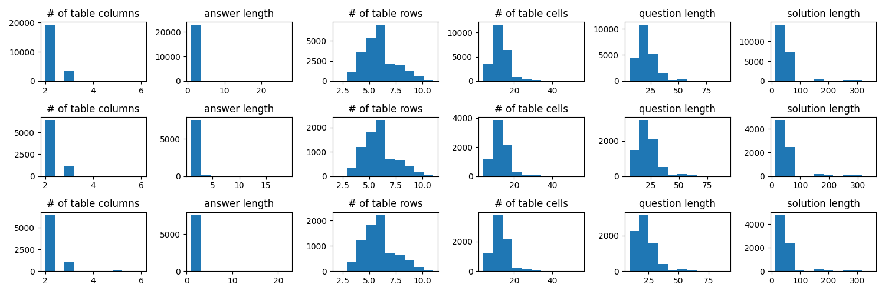
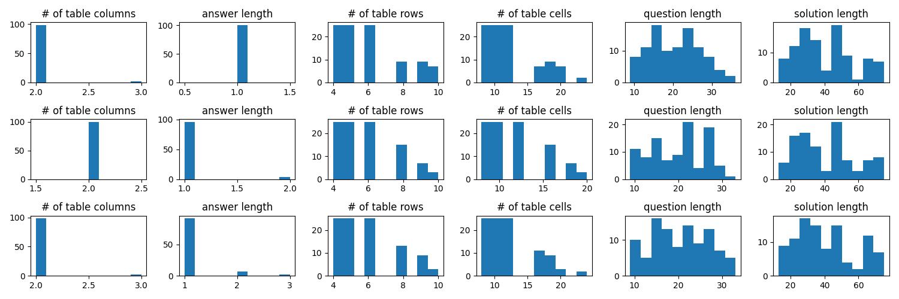

# TabMWP
## Data statistics
Figure below shows the data statistics of this dataset. The three columns represent 'train', 'dev', and 'test' from the top.

Also, you can get the following results by executing 'statistics.py'. We set this attributes from [Table 1] in this [paper](https://arxiv.org/abs/2209.14610).
| Train | Dev | Test |
|-------|-----|------|
|# of free-test questions: 17315 # of multi-choice questions: 5744 # of table columns: &nbsp; - min: 2, mean: 2.20, median: 2.0, max: 6 &nbsp; - 25%: 2.0, 50%: 2.0, 75%: 2.0, 100%: 6.0 answer length: &nbsp; - min: 1, mean: 1.11, median: 1.0, max: 27 &nbsp; - 25%: 1.0, 50%: 1.0, 75%: 1.0, 100%: 27.0 # of table rows: &nbsp; - min: 2, mean: 5.87, median: 6.0, max: 11 &nbsp; - 25%: 5.0, 50%: 6.0, 75%: 7.0, 100%: 11.0 # of table cells: &nbsp; - min: 4, mean: 12.89, median: 12.0, max: 54 &nbsp; - 25%: 10.0, 50%: 12.0, 75%: 15.0, 100%: 54.0 question length: &nbsp; - min: 6, mean: 22.15, median: 21.0, max: 92 &nbsp; - 25%: 16.0, 50%: 21.0, 75%: 26.0, 100%: 92.0 solution length: &nbsp; - min: 13, mean: 49.63, median: 36.0, max: 350 &nbsp; - 25%: 27.0, 50%: 36.0, 75%: 52.0, 100%: 350.0  &nbsp; - len(q1): 691, len(q2): 672, len(q3): 488, len(q4): 22|# of free-test questions: 5710 # of multi-choice questions: 1976 # of table columns: &nbsp; - min: 2, mean: 2.20, median: 2.0, max: 6 &nbsp; - 25%: 2.0, 50%: 2.0, 75%: 2.0, 100%: 6.0 answer length: &nbsp; - min: 1, mean: 1.11, median: 1.0, max: 19 &nbsp; - 25%: 1.0, 50%: 1.0, 75%: 1.0, 100%: 19.0 # of table rows: &nbsp; - min: 2, mean: 5.86, median: 6.0, max: 11 +-25%: 5.0, 50%: 6.0, 75%: 7.0, 100%: 11.0 # of table cells: &nbsp; - min: 4, mean: 12.84, median: 12.0, max: 54 +-25%: 10.0, 50%: 12.0, 75%: 15.0, 100%: 54.0 question length: &nbsp; - min: 6, mean: 22.09, median: 21.0, max: 91 +-25%: 16.0, 50%: 21.0, 75%: 26.0, 100%: 91.0 solution length: &nbsp; - min: 13, mean: 49.46, median: 35.0, max: 348 +-25%: 27.0, 50%: 35.0, 75%: 52.0, 100%: 348.0  &nbsp; - len(q1): 256, len(q2): 224, len(q3): 193, len(q4): 7|# of free-test questions: 5694 # of multi-choice questions: 1992 # of table columns: &nbsp; - min: 2, mean: 2.20, median: 2.0, max: 6 &nbsp; - 25%: 2.0, 50%: 2.0, 75%: 2.0, 100%: 6.0 answer length: &nbsp; - min: 1, mean: 1.11, median: 1.0, max: 22 &nbsp; - 25%: 1.0, 50%: 1.0, 75%: 1.0, 100%: 22.0 # of table rows: &nbsp; - min: 2, mean: 5.85, median: 6.0, max: 11 &nbsp; - 25%: 5.0, 50%: 6.0, 75%: 7.0, 100%: 11.0 # of table cells: &nbsp; - min: 4, mean: 12.83, median: 12.0, max: 54 &nbsp; - 25%: 10.0, 50%: 12.0, 75%: 15.0, 100%: 54.0 question length: &nbsp; - min: 9, mean: 21.94, median: 20.0, max: 89 &nbsp; - 25%: 16.0, 50%: 20.0, 75%: 26.0, 100%: 89.0 solution length: &nbsp; - min: 13, mean: 48.94, median: 35.0, max: 350 &nbsp; - 25%: 27.0, 50%: 35.0, 75%: 52.0, 100%: 350.0  &nbsp; - len(q1): 241, len(q2): 191, len(q3): 223, len(q4): 7|

## How to Choose Its Subset
We divide `# of table rows`, `# of table cells`, `question length`, and `solution length` into quartiles, except for `# of table columns` and `answer length`, which have the same mean and median value. Next, we find the overlapping indexes and randomly selected 25 for each index.

Figure below shows the data statistics of this subsets. The three columns represent 'train', 'dev', and 'test' from the top.

